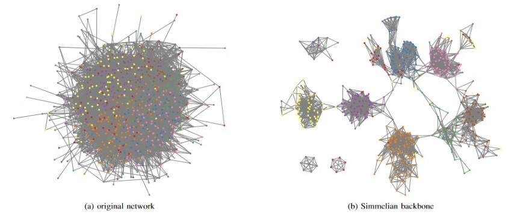

# simmelian-backbone
Python code to calculate a Simmelian backbone from a network edgelist
## Overview
This software implemenets a Simmelian backbone network analysis as described by [Nick, Lee, Cunningham, and Brandes](https://www.researchgate.net/publication/262207813_Simmelian_backbones_amplifying_hidden_homophily_in_Facebook_networks) in 2013. The method has an almost magical ability to untangle "hairball" networks by removing links that are not part of embedded relationships. The effect is apparent in this figure from the Nick, et al., paper showing a large Facebook friends network:

Prior to this implementation, the analysis was only available in [Visone](https://visone.ethz.ch/), a GUI-based network analysis package. This Python implementation offers the same functionality for calculating the backbone as Visone, except as a stand-alone implementation that can be used for larger networks, in processing pipelines, etc.

## Credits

Code written by [Suraj J. Unni](https://github.com/surajjunni). Specifications and testing by [Steve Corman](https://github.com/networks1). We thank [Julian Müller](https://sn.ethz.ch/profile.html?persid=243533) and [Ulrik Brandes](https://github.com/ubrandes-ethz) of the Visone team for sharing code and consulting about implementing the method.

## Environment
* Python 3.8
* [NetworKit](https://networkit.github.io/) 7.1
* [Numpy](https://pypi.org/project/numpy/) 1.23.0
* [Pandas](https://pandas.pydata.org/) 1.4.3

## Running the Code
The script will output all of the edges' input values with calculated backbone strength and inclusion values added.
To run the script:
>python3 backbone.py [--argument1=value, --argument2=value ...]

Where:
Argument | Description | Options | Default
--- | --- | --- | ---
edgelist | File containing the input edgelist in .csv format. Analysis assumes that the network is undirected. The first row must contain a header. The first two columns must contain node labels that define the edges. Additional columns may contain edge-related atrributes (such as weight) but these are not considered in the calculations. | Valid path/filename | input.csv
method | Option to calculate redundancy values using triangles or quadranges. | triadic, quadrilateral | quadrilateral
threshold | Minimum redundancy required to include an edge in the backbone. | Decimal value in range 0 - 1 | 0.2
multiedges | Whether redundant edges and loops are to be included in the redundancy calculations. | yes,no | no
connectivity | Whether non-backbone edges from a minimal spanning tree should be retained to connect backbone components. | maintain,ignore | maintain
prune | Whether non-backbone edges should be excluded from the output. | yes,no | no
outputlist | Filename where the output should be written. | Valid path/filename | backbone.csv
verbose | Whether the script should print analysis steps and times to STDOUT. | yes,no | no

